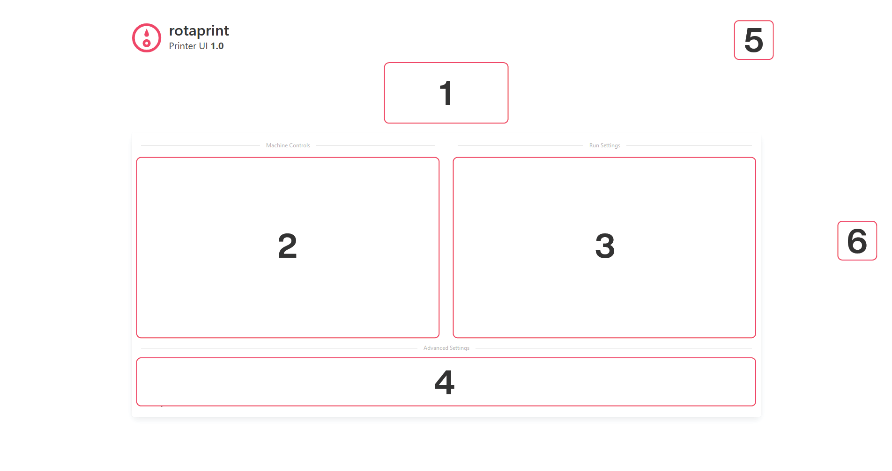

# rotaprint

_This project is a student project from the University of Bath, with sponsorship from DCA Design International. All content in this repository is owned by me. Due to the nature of this project, download or modification of this project and it's source code for **personal use and educational purposes** is allowed, however redistribution, publishing, or any use of code or other elements in different projects is **not allowed**._

_All rights reserved._

---

Welcome to rotaprint, your all-in-one software solution for interfacing with the rotaprinter. This manual is split into two sections; Setup, and Use. It is recommended you read the manual in full before first use. The [Quickstart](#Quickstart) guide can be used for reference after the machine has been set up already.

This is a guide, all information is up-to-date at the time of writing. If you are having issues, ensure you have followed each step correctly. The setup guide assumes you have some existing software experience, for example use of the command line.

- [Setup](#setup)
  * [Installation](#installation)
    + [Overview](#overview)
    + [Requirements](#requirements)
    + [Firmware Setup](#firmware-setup)
    + [Software Setup](#software-setup)
  * [Initial Configuration](#initial-configuration)
  * [Resetting the Machine](#resetting-the-machine)
- [Use](#use)
  * [General Operation](#general-operation)
  * [User Interface](#user-interface)
  * [Home](#home)
    + [GCODE Uploader](#gcode-uploader)
    + [Machine Controls](#machine-controls)
    + [Run Settings](#run-settings)
    + [Surface Speed Considerations](#surface-speed-considerations)
    + [Manual Commands](#manual-commands)
    + [Machine Settings](#machine-settings)
    + [Logs and Notifications](#logs-and-notifications)
  * [Generating GCODE](#generating-gcode)
  * [Monitor](#monitor)
- [Quickstart](#quickstart)

# Setup

The setup sequence is divided into two main sections:

- Installation
- Initial Configuration

## Installation

### Overview

rotaprint consists of three separate components:

- UI front-end. This is the bit you open on your computer to control the printer. It talks to to the logic back-end using a protocol called WebSocket. You don't install this, it is accessed through a web-browser.

    `HTML`, `JavaScript`, and `CSS`

- Logic back-end. This bit does all the high-level thinking, controlling the scanner and alignment, batch production, and much more. It talks to the firmware with a USB cable. You install this on a computer physically connected to the printer.

    `Python 3`

- Firmware. This is the low-level code which is installed on an Arduino or Arduino-compatible Mega. It controls the stepper motors and physical I/O. It is based off an open-source project called *grbl*. More information can be found under [Firmware Setup](#Firmware%20Setup).

    `C`

### Requirements

- Computer for running logic back-end
    - Windows, Linux, or macOS
    - May be headless or embedded (e.g. Raspberry Pi)
        - If headless, requires internet connection and fixed IP address
    - 2 x USB 2.0
- Computer to access front-end
    - May be the same device running the back-end
    - Does not need to be a dedicated device (e.g. can be accessed from an engineer's laptop)
    - A modern internet browser (Firefox 75 or higher recommended)
    - Recommended 1080p or higher display
- Ardunio (Arduino compatible) Mega 2560
- USB A to B cable
- An internet connection

### Firmware Setup

The firmware installed on the Arduino is a fork of popular CNC firmware *grbl*. Called *grbl-Mega-5X*, the source code can be found on GitHub at [fra589 / **grbl-Mega-5X**](https://github.com/fra589/grbl-Mega-5X).

Official instructions can be found on the [grbl wiki](https://github.com/gnea/grbl/wiki/Compiling-Grbl). Alternatively, follow the instructions below.

Any computer can be used to setup the firmware, it does **not** have to be the same one you use later to run rotaprint.

1. Download .zip file source code of the `v1.1l` release of grbl-Mega-5X, from the [GitHub releases page.](https://github.com/fra589/grbl-Mega-5X/releases)

    v1.1l is the latest update at the time of writing. Later releases may be available, which may include useful bugfixes, however these are untested with rotaprint.

2. Extract the contents of the .zip file to somewhere safe, like your Desktop.

    
    <br>*Contents of extracted grbl source code*

3. Download and install the latest Arduino IDE from the [Arduino website](https://www.arduino.cc/en/Main/Software).

4. Launch the Arduino IDE.

5. Load the `grbl` folder above into the Arduino IDE as a library.
    - Click on `Sketch` in the menu bar, navigate to `Include Library` and select `Add .ZIP Library`.
    - Select the `grbl` folder *inside* the folder you extracted in step 2, which **only** contains the source firmware files and an `examples` directory.
    - If you accidentally select the wrong folder, you will need to navigate to your Arduino library, delete the mistake, and re-do this step.
    - You can confirm that the library has been added. Click the `Sketch` drop-down menu again, navigate to `Include Library`, then scroll to the bottom of the list where you should see `grbl`.

6. Click on `File` in the menu bar, navigate to `Examples` > `Grbl`, and select `GrblUpload`.

7. Connect the Arduino Mega to your computer.

8. Make sure your board is set to the Arduino Mega in the `Tool` > `Board` menu, and that your serial port is selected correctly in `Tool` > `Serial Port`.

    Finding the correct serial port can be done in different ways depending on your OS. MathWorks have good instructions [here](https://web.archive.org/web/20200428123840/https://uk.mathworks.com/help/supportpkg/arduinoio/ug/find-arduino-port-on-windows-mac-and-linux.html).

9. Click `Upload`, and grbl should compile and flash to the Arduino!

### Software Setup

The software for rotaprint is split into the back-end logic, and the front-end web UI. The back-end logic is written in Python, and must be installed on a computer physically connected over USB to the Ardunio from the previous section. The front-end UI does **not** need to be installed.

**Ubuntu 18.04** was used for running the software during development, and so instructions are Ubuntu based. If you decide to use Windows, macOS, or a different Linux distribution, some steps may vary slightly however the overall process should be very similar.

The source code is provided, in a folder called rota-print. Place this somewhere you have execute access, such as `/opt/rota-print` if you are an admin, or your home directory.

Python 3.6 was used for testing, however any version of Python 3 should work.

1. Install Python 3 if required (it is pre-installed on Ubuntu 17.10+ and macOS). Instructions can be found [here](https://web.archive.org/web/20200414190831/https://realpython.com/installing-python/).

2. Check `pip` and `venv` are installed.

    ```bash
    sudo apt-get update
    sudo apt-get upgrade
    sudo apt-get -y install python3-pip python3-venv
    ```

3. Navigate to your `rota-print` folder.

    ```bash
    cd ~/rota-print/
    ```

4. Create and activate a virtual environment within this folder.

    ```bash
    # Uses the fish shell. Use Bash or whatever you prefer instead if you want!
    python3 -m venv .venv
    source .venv/bin/activate.fish
    ```

5. Install required Python dependencies.

    ```bash
    pip3 install -r requirements.txt
    ```

6. Create a new `nodeenv` environment, and check installation was successful. Output should be a version number such as `6.14.4`.

    ```bash
    nodeenv -p; npm install -g npm; npm -v
    ```

7. Install required JavaScript dependencies.

    ```bash
    npm install
    ```

The software is now installed! You start it by running `rotaprint.py` with Python 3

```bash
python3 rotaprint.py
```

The logs are displayed in your terminal window (these can also be accessed through the web interface). It is recommended to have easy access to these, should any critical errors occur or the software needs to be restarted (quit using `Ctrl + C`).

## Initial Configuration

When `rotaprint.py` is running, it can be accessed through a web browser using one of the following urls:

```bash
http://localhost:8080/web/  # When accessing from the local computer
http://[host-ip]:8080/web/  # When accessing from a different computer
```

You should be presented with the following UI.


<br>*If the UI does not look like this, ensure you followed the installation instructions correctly! If you can't access any UI, ensure the IP address you are using is correct, and that it has not changed.*

Access the machine settings by clicking on the gears in the top right.


<br>*Machine settings screen on a new rotaprint installation*

The left panel contains quick-links to various categories. The `Apply Settings` button will display the number of settings you've changed from their defaults. It is recommended to enable `Advanced Settings` for this initial setup process, allowing full control over all parameters.


<br>*Settings menu*

The settings are grouped as follows:

- Printer Connection

    Adjust the connection between the firmware and the back-end code.

- Default Settings

    Control what the pre-filled values are on the homepage. Useful if you are only working with a specific radius part, or frequently need a batch size of two.

- General Settings

    Various parameters controlling how the software works, warning messages, or pen control.

- Batch Settings

    Settings specific to the batch functionality of the software.

- Controller Settings

    Settings specific to the grbl firmware. Some are unused at this time (e.g. `$6 Probe Pin Invert`) but are included for potential future use.

- Movement Settings

    Important parameters which adjust the conversion between electrical signals and physical movement.

Each setting has a short description below it, used to help identify what it does. Each setting indicates the expected unit or type of input. A `Default` button will reset that setting to it's factory value.


<br>*An example machine setting*

When you change a setting from what is currently stored in the database, it will highlight in yellow, indicating the change, and the `Apply Settings` button will update to indicate how many settings have been altered.


<br>*An example machine setting after changing the value*


<br>*Apply Settings button reflecting the number of changes made*

Once you have made changes, click on `Apply # Settings`. A confirmation screen will present you with the changes you have made. Check this, and once happy click `Save Changes`.

Before anything else, set the correct **Communication Port**, save changes, and restart rota-print. The logs should display a confirmation message similar to below. If it displays an error, check you have the correct port.

```
rotaprint   : INFO     Connecting to printer...
rotaprint   : DEBUG    Connecting on port /dev/ttyS3...
rotaprint   : INFO     Connection success!
rotaprint   : DEBUG    GRBL < "\r\n\r\n"
rotaprint   : DEBUG    
rotaprint   : DEBUG    Grbl 1.1h ['$' for help]
rotaprint   : DEBUG    [MSG:'$H'|'$X' to unlock]
```

Once the startup sequence is complete, upon reconnection to the web-interface, you should receive a success notification as shown below:


<br>*Toast notification showing the printer has successfully connected*

Spend time working through each setting, understanding what it means, and setting an accurate value. You can always change these at a later stage. 

Inputs are intentionally unconstrained - meaning you can enter `882435` instead of a boolean `1` or `0`, or a negative time delay value. Doing something like this will almost certainly break stuff!

Once complete, apply and confirm your changes. The software will save the settings to a local SQLite database called `rotaprint.db`. If needed, this file can be deleted and rotaprint restarted to restore all default settings. It will also attempt to send updated settings to the grbl firmware. Check the logs to ensure no errors occurred at this stage, otherwise you may need to undo and redo the change in an attempt to re-send the updated settings.

The below code shows a failed attempt to update nine settings. The line `GRBL <* 1: $33=0.0` shows a message which has been sent to grbl, and `GRBL > 1: error:3` shows grbl's response.

```
rotaprint   : DEBUG    Up to date setting: $132
rotaprint   : DEBUG    Out of date setting: $133
rotaprint   : DEBUG    Out of date setting: $134
rotaprint   : INFO     9 setting(s) need updating!
rotaprint   : INFO     Sending updated settings...
rotaprint   : DEBUG    GRBL <* 1: $33=0.0
rotaprint   : WARNING  GRBL > 1: error:3
rotaprint   : DEBUG    GRBL <* 2: $103=250.0
rotaprint   : WARNING  GRBL > 2: error:3
rotaprint   : DEBUG    GRBL <* 3: $104=250.0
rotaprint   : WARNING  GRBL > 3: error:3
```

rotaprint implements two different methods of 'talking' to the firmware. More details can be found in the source code comments, but here the asterisk `*` indicates the message was sent using the simple *call-response* protocol. No asterisk would indicate a more aggressive *buffer* protocol was used.

## Resetting the Machine

If, at any point, you need to reset the software and start a new session, the recommended procedure is as follows:

1. Close any existing browser windows accessing the rotaprint UI.

2. Stop the rotaprint software by pressing `Ctrl + C` on the running terminal.

3. Press the physical reset button on the control box for ~1s.

4. Wait a few seconds for the firmware to boot, before starting `rotaprint.py`.

5. Wait for the logs to indicate successful connection to the firmware, and that settings have been checked or updated if required.

6. Reconnect to the rotaprint UI. A toast notification should indicate the printer is successfully connected.

# Use

## General Operation

The standard operation using default settings for the rotaprinter is as follows:

1. A print program is loaded into the printer software through the UI.
2. Settings such as number of parts in the batch, and part radius are configured.
3. The engineer starts the print job.
4. The printer will move the first part in the job under the computer vision scanner, which will detect physical features on the part and ensure rotational alignment with the print image.
5. The part moves into the printing area, where a pen nib will print the programmed graphics. Colour changes are possible throughout the design, with up to four colours being supported.
6. The part is moved back under the scanner for quality inspection.
7. Once the part is complete, steps 4 through 6 repeat for the remaining parts in the batch production, unless an issue is highlighted through quality inspection, at which point the machine will pause operation for manual checking.

## User Interface

The rotaprint UI consists of two main pages:

- Home (including Machine Settings discussed in [Initial Configuration](#Initial%20Configuration).)
- Monitor

Upon starting rotaprint (running `rotaprint.py` with Python 3), the UI can be accessed through a web browser at one of the following urls:

```bash
http://localhost:8080/web/  # When accessing from the local computer
http://[host-ip]:8080/web/  # When accessing from a different computer
```

Only one user can access the rotaprint UI at a time. If you attempt to connect while another user has the UI open you will be denied access. This can also happen if you try to connect in more than one tab.


<br>*Access to the UI is denied if someone else already has the UI open elsewhere.*

## Home

The rotaprint homepage is divided as shown:



1. GCODE upload box
2. Machine controls (like home and print)
3. Next run settings (like number of parts, or part radius)
4. Advanced commands (if you need to talk directly with the backend)
5. Machine settings
6. Logs

### GCODE Uploader

The software is designed to work with standard UTF-8 plaintext GCODE (frequently used by CAM machines), however subtle tweaks may be required to ensure the code works as expected. Machine specific tweaks are summarised below. The recommended method of creating the GCODE to submit is shown in [Generating GCODE](#Generating%20GCODE).

|Command|Description|
|-------|-----------|
|G0 Z1  |Apply pen to part|
|G0 Z0  |Lift pen from part|
|<C#>   |Change to colour number # (0 to 3)|
|G0 A#  |Direct control of batch axis (A)|
|G0 B#  |Direct control of colour axis (B)|

Sample GCODE files have been provided under the `sample_files` folder, specifically `sample.gcode` is a logo in GCODE printed in colour A, and `sample_colour.gcode` is the same image with added colour changing. The original vector artwork is `sample.svg`, which is at 1:1 print scale.

### Machine Controls

Used to control the machine prior to printing. The first step is always to home the machine, allowing the firmware to zero all axes. The Y axis is infinite, and so the Arduino is wired to believe the Y axis limit pin is always triggered.


<br>*Machine control buttons*

This may cause issues if  `Hard Limits` are enabled in the settings, as it will prevent the axis from turning. Alternative solutions could include wiring the limit pin to a physical switch which is triggered manually during homing, or re-compiling grbl with the limit-checking code removed for this axis.

Once homed, the other printer controls are unlocked. `Toggle Lighting` will enable the lights and laser to aid with alignment. The `Move Batch` slider will position the requested part under the camera scanning system, or move the batch axis back to `0` (if slider is at `H`).

The two `Align Y` sliders are used to adjust rotation of the part in the Y axis. Use them to rotate the part until the laser aligns with the position you wish to start printing at (0, 0). The `Coarse` slider has steps of 5°, the `Fine` slider has steps of 0.1°. For more granular control, click **once** on the slider handle, and with the mouse cursor hovering over the slider bar use the scroll wheel, or arrow keys to increase or decrease the rotation.

`Print` will start the print job, and redirect the user to the Monitor page if the print has successfully started. If you are redirected back to the home page, check the logs for issues.

### Run Settings

These contain settings specific to the following batch run, and must be accurate to ensure correct print procedure.

- Check Mode

    Used to validate GCODE files before actual printing. Further description can be found by clicking the `?` link.

- Scan Mode

    Can entirely disable the computer vision system, including alignment and quality assurance, if required. Could be disabled if parts are rotationally symmetric.

- Part Radius

    The radius of the part to print on in mm. This is used to calculate the step ratio for the Y stepper motor (to ensure the print is not *stretched*), determine the distance the pen needs to move when in contact with the part, and calculate the real surface speed of the pen nib.

- Surface Speed

    This shows the actual maximum surface speed of the pen nub relative to the part in the Y direction only. Discussed further in Surface Speed Considerations.

- Part Length

    Used to supply the length of the part to the back-end code.

- Batch Size

    The number of parts in the batch which are to be printed on.

### Surface Speed Considerations

The firmware contains parameters which can limit the maximum rate of any stepper motor. This is useful for the Y and X motors, as it can affect how fast the pen moves relative to the part, which may affect drawing quality.

The max X speed is in mm/min, which makes it easy to calculate a desired maximum speed and set it for all parts. However, due to limitations imposed by the grbl firmware, the max Y speed is in °/min. Naturally, this means a larger diameter part will have a greater surface speed than a smaller diameter part, for a given radius.

Although it is possible to compensate the angular max rate to ensure a constant surface speed, this involves sending an updated setting to grbl for every new diameter part. Every time grbl receives a new setting, it writes it to the Arduino's EEPROM persistent storage.

The Arduino's EEPROM has a limited number of writes, and so frequently updating this setting (or any setting) will reduce the lifespan of the Arduino, eventually requiring replacement.

To help with this, the max Y speed is **not** automatically updated. Instead, the home screen shows the calculated `Surface Speed` in the Y direction, for the given part radius and current max Y speed setting value. It can be used to evaluate if the surface speed is acceptable, and therefore avoid an additional EEPROM write by updating the setting.

The surrounding box will turn green if the calculated value is within a set percentage of the max X surface speed. It will turn red it it is outside this range. The percentage value at which this occurs can be configured in the machine settings.

### Manual Commands

Communication between the UI and Python back-end is done using a number of 'machine code' commands. They are being sent constantly in the background, but if required an engineer can manually send commands to the back-end. These are summarised below.

Although unrecognised commands will be caught and give an error, it is still possible to cause damage to the software or physical machine using these commands. Use with caution!

|Command|Payload|Description                               |Response      |
|-------|-------|------------------------------------------|--------------|
|SET    |JSON   |Settings for current print                |"DONE"        |
|DBS    |STRING |Database setting update                   |"DONE"        |
|GRB    |STRING |Send manual code to GRBL                  |"DONE"        |
|GCD    |BLOB   |Send GCODE print program                  |"DONE"        |
|PRN    |NONE   |Print now                                 |"DONE"        |
|HME    |NONE   |Home machine                              |"DONE"        |
|FTS    |NONE   |Fetch all current settings                |Settings array|
|RQV    |STRING |Request value of variable                 |Current value |
|RCN    |NONE   |Reconnect to machine                      |"DONE"        |
|LOG    |NONE   |Request log messages                      |Logs array    |
|RLC    |NONE   |Reset log counter                         |"DONE"        |
|GCS    |NONE   |Get current machine status                |Status array  |
|LGT    |NONE   |Toggle lighting                           |"DONE"        |
|BTC    |INT    |Move to batch component #. 0 moves to home|"DONE"        |
|FHD    |NONE   |Feed hold                                 |"DONE"        |
|FRL    |NONE   |Release feed hold                         |"DONE"        |
|QCO    |NONE   |Quality control error override            |"DONE"        |

### Machine Settings

Button to access the machine settings page, and update or change machine settings. This is further discussed in [Initial Configuration](#Initial%20Configuration).

### Logs and Notifications

Toast notifications appear in the bottom right of the screen to notify the user of success or failure of specific actions.


<br>*Error message displayed when printer could not connect*


<br>*At any point, the logs can be viewed by clicking on the logs icon on the right of the screen.*

The logs will always display additional information about the current process. Log messages are colour coded based on the information they display. It is recommended to frequently check the logs when performing actions, to ensure they have completed as expected.


<br>*Example messages of different log levels, colour coded based on the information they display*

Some debug messages are of the following format:

```
10:48:12	DEBUG	WSKT > RQV "websocket"
10:48:12	DEBUG	WSKT < RQV "{"command": "websocket", "payload": "1"}"

10:57:28	DEBUG	GRBL <* 1: G0A160.0
10:57:28	DEBUG	GRBL > 1: ok
```

They visualise the two way communication between the front-end UI and the back-end logic (over WebSocket, symbolised `WSKT`), and between the back-end logic and the grbl firmware (`GRBL`). The arrow indicates whether the message was sent to (`<`) or received from (`>`) the destination.

If required, `Auto update` can prevent the logs from updating while you are investigating a specific issue or response. The maximum log history can be set in the machine settings, after which the logs will be removed from this page. This is done to improve responsiveness of the UI, and full logs history can always be found in the original terminal where `rotaprint.py` is running.

## Generating GCODE

The software accepts a GCODE program as the instructions to print. Typically used for milling machines, laser cutters, and 3D printers, it is not a file format that can be exported from standard graphics software used to create printed graphics, such as Adobe Illustrator.

The method to convert a **vector** image from inside Adobe Illustrator, to usable GCODE for rotaprint is shown below. It makes use of an open-source plugin called Adobe Illustrator to G-code Panel, by Diego Monzon. A cached download of the panel can be found [here](https://web.archive.org/web/20200428190246/https://static1.squarespace.com/static/51a651d6e4b0e53a42a86a44/t/5e1aa2873ff3900c1383220e/1578803848173/Export+to+G-code+V5.jsx.zip).

The plugin was tested to work with Adobe Illustrator 24.0.1 (2020)

1. Install the plugin by copying `Export to G-code V5.jsx` into `Applications / Adobe Illustrator 2020 / Presets / en_US / Scripts/`

2. Open the file you want to print.
    - **The image must be 1:1 scale!** You may check this by showing rulers (`Ctrl + R`), right clicking on one, and changing the unit to `mm`.

    - The bottom left of **your artboard** is **(0, 0)**, with *right* and *up* being positive.

    - The artboard should entirely contain your image! Paths outside the artboard will be truncated!

    - The software will trace all paths, creating outlines of your shapes.

    - If you want to print text, you must first convert it to a shape; right click on the text and select `Create Outlines`

        
        <br>*Converting text to vector outlines in Adobe Illustrator*

    - Use of clipping masks will often cause the conversion to fail. Remove all clipping masks from the design before attempting to convert.

    - If you want to print in different colours, set the **stroke colour** as follows (shown in hexadecimal):

        **#000000** - Colour A

        **#FF0000** - Colour B

        **#00FF00** - Colour C

        **#0000FF** - Colour D

        
        <br>*These colours are **not** representative of the final print colour, they are just indicators to change to a specific pen during printing!*

    - If you want to print a raster image, you may be able to use Illustrator's Image Trace function. Select your image and then find it under `Object` > `Image Trace` > `Make and Expand`.

        
        <br>*Left: input raster image. Right: output vector image after using the Image Trace function.*

    - To 'fill' a shape with block colour, the recommended method is to use Illustrator's `Offset Path` function. The offset value should be smaller for higher density colour.

        
        <br>*Offsetting a path to emulate printing of block colour*

3. Once you are happy with the image, open the gcode conversion panel under `File` > `Scripts` > `Export to G-code V5`.

4. The print settings should be as shown below. The output gcode will save to the file set under `Output File`. You can load these default settings, using the provided file `sample_files/gcode_panel_v5.settings`. Feed rate can be set if required, however it is recommended to keep this high.

    
    <br>*Overview of the gcode conversion panel*

    For reference, the commands **G0Z0** lifts the pen from the paper, **G0Z1** applies the pen to the paper, and **<C#>** is a custom command which switches pen colours.

5. Click `Generate G-code`.

6. Once complete, check the output file to validate the conversion has worked. The start should look similar to the following:

    ```
    G0 F3000
    G90 G21
    G0 X0.02 Y21.18
    G1 F1000
    G0 Z0
    G0 X0.02 Y21.18
    G0 X0.02 Y21.18
    G0 X0.04 Y28.88
    G0 X0 Y36.57
    G0 X0 Y36.57
    G0 X0 Y36.88
    ```

## Monitor

Once a print job has successfully begun, the connected user will be redirected to the *Monitor* page. At this point, the back-end is controlling the program flow, and so the user can close and re-open the rotaprint window as required.


<br>*The rotaprint monitoring page*

This page is designed to provide the user with in-depth information about the current state of the machine. It is split into tiles, grouped by similarity.

The top left row of tiles displays general information about the running program; **time elapsed** since the print started (while running), the **number of parts in the batch** that are complete, an estimation of the **time remaining** on the job, and the current **machine status**.

The next tile displays the **print progress** of the current part. When this bar is filled, either processing on the next part will begin, or the print job will be complete.

The next row of tiles displays DRO (digital readout) information about the machine. The alarm tile will change to red if an alarm is active. The X, Y, and Z readouts show the pen nib's current position. The polling frequency at which these are updated can be adjusted in the machine settings.

The next tile contains information about the latest error raised by the firmware. Often, these are non-critical and may be ignored, however it is important to understand the cause of each error. Full reference for all grbl errors can be found on the [grbl wiki](https://web.archive.org/web/20170714064222/https://github.com/gnea/grbl/wiki/Grbl-v1.1-Interface#grbl-response-messages).

The final row of tiles contains ways of interacting with the machine while it is running. `Feed Hold` will pause the running program, allowing for inspection. The current machine status will update to `Hold`, and the tile will turn yellow to indicate this. `Continue` will resume the program. Once the job has finished, `Complete` will redirect the user back to the home page. Alternatively, reload or reconnect once the print job is complete and the user will be redirected to the home page.

At all times, the logs window is present on the right hand side. This can be monitored for issues as discussed in previous sections.

# Quickstart

This quickstart guide is intended to give you a brief overview of the functionality of rotaprint. It is recommended to read the full manual to gain a more in-depth understanding of the software.

1. Open the design you want to print in Adobe Illustrator.
    - Ensure the image is 1:1 scale.
    - The bottom left of the artboard is 0, 0 on the printer.
    - The printer will trace all paths, you need to `Create Outlines` on all text.
    - The four colour options are **#000000**, **#FF0000**, **#00FF00**, and **#0000FF**

    
    <br>*Sample print file open in Adobe Illustrator*

2. Use the illustrator to GCODE panel to export your design, using the pre-supplied settings.

    
    <br>*Overview of the gcode conversion panel*

3. Connect to rotaprint using a web-browser. Upload your GCODE file using the UI.

    
    <br>*The rotaprint home page UI*

4. Turn on the lights and alignment laser, and align the rotation of the part to the start of your print.

5. Enter the correct part dimensions, and the batch size.

6. Press `Print`. You can monitor the printer from the following page.

    
    <br>*The rotaprint monitoring page*

7. Once the batch is complete, or if the printer detects an issue during quality inspection, this will be highlighted on the monitoring screen.
